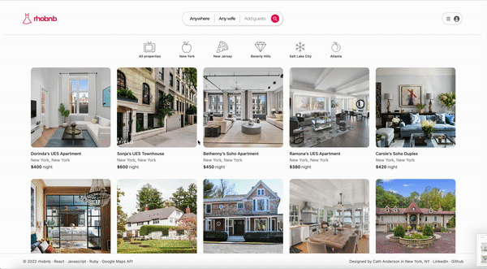
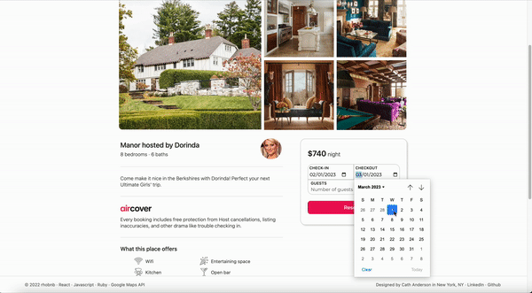

## RHOBNB

***

### **Background** 🏞

[RHOBNB](https://rhobnb.onrender.com/) is a *Real Housewives* themed full-stack clone of the property booking website Airbnb.

***


### **Functionality & MVPs** 🏋🏼‍♀️

1. Full user authentication *(including error handling!)* and ability to create new accounts
2. Live hosting on [rhobnb.render.com](https://rhobnb.onrender.com/)
3. Ability to browse properties owned by current and former *Real Housewives* of New York, New Jersey, Beverly Hills, Salt Lake City, and Atlanta
4. Ability to reserve properties as well as modify and cancel existing reservations
5. *(Ficticious)* home location data with the help of Google Maps API
6. Users can view reviews made by previous home guests on applicable property show pages

***
### **Technologies, Libraries, and APIs** 👩🏼‍💻

This project will be implemented with the following technologies:

- Ruby on Rails, React/Redux, Javascript, HTML, and CSS 
- PostgreSQL and Amazon Web Services
- Google Maps API 
- Webpack and npm

***
### **Technical Highlights** ⚡️

#### **Sorting properties by franchise with dynamic map updates**


Just like the real Airbnb, RHOBNB's splash page is a pure properties index page without a map. The real Airbnb has many icons with activities/settings to sort homes by and upon clicking one of those icons, the site filters property results by that activity/setting. With RHOBNB being based on a TV phenomenon associated with dozens of different cities ("franchises"), I figured it'd be a fun idea to give my users the ability to filter their property results by city/franchise.

All told, this was a fun exercise in categorization/SQL querying on the backend as well as Google Maps manipulation on the frontend.

*properties_controller.rb*
```ruby...
class Api::PropertiesController < ApplicationController
    ...

    def index
        if params[:rh_franchise] == nil
            @properties = Property.all
        else
            @properties = Property.where(rh_franchise: params[:rh_franchise])
        end
        render :index
    end
    ...
end
```

*MapContainer.js*
```js...
const MapContainer = ({ rh_franchise }) => {
  const properties = useSelector(getProperties);

  ...

  let defaultCenters = {
    rhony: {
      lng: -73.98772938211399,
      lat: 40.74694716164171,
    },
    rhonj: {
      lng: -74.19496009763303,
      lat: 40.905374300770426,
    },
    rhobh: {
      lng: -118.43215308090113,
      lat: 34.06132233736488,
    },
    rhoslc: {
      lng: -111.74122952661914,
      lat: 40.653710288478784,
    },
    rhoa: {
      lng: -84.25407173324143,
      lat: 33.84412178411214,
    },
  };

  let zoomAmounts = {
    rhony: 13,
    rhonj: 10.5,
    rhobh: 10.45,
    rhoslc: 10.45,
    rhoa: 11,
  };

  let locations = {};

  properties.forEach((property) => {
    locations[property.id] = {
      name: property.propertyName,
      location: {
        lng: property.lng,
        lat: property.lat,
      },
      id: property.id,
    };
  });

  ...

  return (
    <LoadScript googleMapsApiKey={process.env.REACT_APP_MAPS_API_KEY}>
      <GoogleMap
        mapContainerStyle={mapStyles}
        zoom={zoomAmounts[rh_franchise]}
        center={defaultCenters[rh_franchise]}
        options={{
          styles: rhobnbMapStyles,
        }}
      >
        {Object.values(locations).map((item) => {
          return (
            <Marker
              key={item.name}
              position={item.location}
              onClick={() => onSelect(item)}
              icon={pin}
            />
          );
        })}
        ...
      </GoogleMap>
    </LoadScript>
  );
};
```

#### **Reservation booking and show page**


Upon booking a reservation at one of the site properties, the user is automatically taken to a page displaying their pre-existing reservations plus the reservation they just booked. They can then select whichever reservation they'd like to see more details on which leads them to a reservation show page with a map custom fit to the booked property's longitude/latitude coordinates.

This was accomplished by passing the given reservation's ID from the show page URL parameters as a prop to a ReservationMap React component then manipulating the data for use in the accompanying Google map.

*ReservationShow.js*
```js...
function ReservationShow() {
  const dispatch = useDispatch();
  const { id } = useParams();
  ...

  useEffect(() => {
    dispatch(fetchReservation(id));
  }, [id, dispatch]);

  const reservation = useSelector((state) => state.reservations[id]);
  ...

    return (
    <>
      <div className="reservation-show">
        ...
        <ReservationMapContainer reservation={reservation}/>
      </div>
    </>
  );
}
```

*ReservationMapContainer.js*
```js...
const ReservationMapContainer = ({ reservation }) => {
  ...

  let defaultCenter = {
    lng: reservation.property.lng,
    lat: reservation.property.lat,
  };

  let location = {
    name: reservation.property.property_name,
    location: {
      lng: reservation.property.lng,
      lat: reservation.property.lat,
    },
  };

  ...

  return (
    <LoadScript googleMapsApiKey={process.env.REACT_APP_MAPS_API_KEY}>
      <GoogleMap
        mapContainerStyle={mapStyles}
        zoom={16}
        center={defaultCenter}
        options={{
          styles: ReservationMapStyles,
        }}
      >
        ...
      </GoogleMap>
    </LoadScript>
  );
};
```
