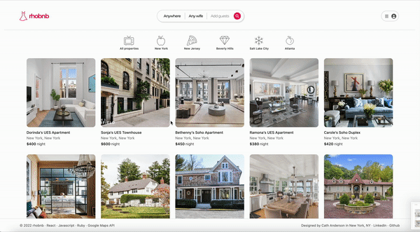
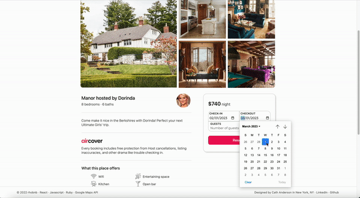

## RHOBNB

***
### **Background** 🏞

[RHOBNB](https://rhobnb.onrender.com/) is a *Real Housewives* themed full-stack clone of the property booking website Airbnb.

***
### **Functionality & MVPs** 🏋🏼‍♀️

1. Full user authentication *(including error handling!)* and ability to create new accounts
2. Live hosting on [rhobnb.render.com](https://rhobnb.onrender.com/)
3. Ability to browse properties owned by current and former *Real Housewives* of New York, New Jersey, Beverly Hills, Salt Lake City, and Atlanta
4. Ability to reserve properties as well as modify and cancel existing reservations
5. *(Ficticious)* home location data with the help of Google Maps API
6. Users can view reviews made by previous home guests on applicable property show pages

***
### **Technologies, Libraries, and APIs** 👩🏼‍💻

This project will be implemented with the following technologies:

- Ruby on Rails, React/Redux, Javascript, HTML, and CSS 
- PostgreSQL and Amazon Web Services
- Google Maps API 
- Webpack and npm

***
### **Technical Highlights** ⚡️

#### **Sorting properties by franchise with dynamic map updates**

#### **Reservation booking and show page**

